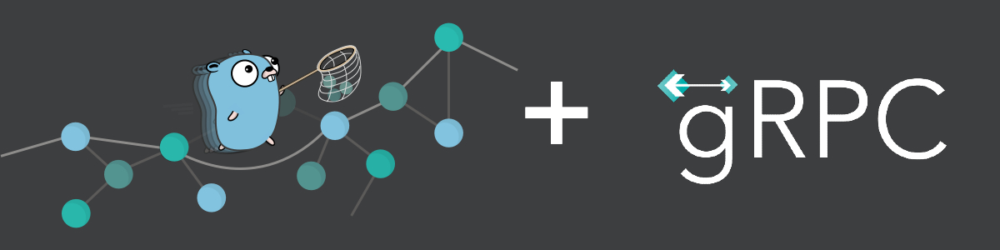
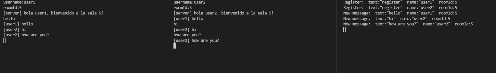

# Real-time Chat Application with gRPC and Go

Welcome to my real-time chat application built using Go and gRPC. This project is a showcase of my ability to build high-performance applications with modern technologies.

## Project Overview

This is a chat application that enables real-time communication between multiple users. It utilizes [Go](https://golang.org/) for back-end development, [gRPC](https://grpc.io/) for efficient, high-performance communication between the client and server, and [PostgreSQL](https://www.postgresql.org/) for message persistence.

Here's a breakdown of the main components:

- `client.go`: Handles client-side logic for the chat application. It connects to the server, sends and receives chat messages.

- `server.go`: Manages server-side logic. It handles client connections and broadcasts messages to all connected clients.

- `db.go`: Contains logic for database operations such as starting the database, adding messages, and retrieving messages.

- `proyect1grpc.proto`: Defines the service and message structure for the gRPC communication.

## Key Features

- **Real-time Communication**: The chat application supports real-time message exchange between multiple users.

- **Persistence**: All messages are stored in a PostgreSQL database, so the chat history is persistent and can be retrieved later.

- **gRPC and Protocol Buffers**: The project uses gRPC for communication between the client and server, offering efficiency and performance benefits. Protocol buffers are used for defining the message and service structure.

- **Error Handling**: The application includes basic error handling for common scenarios such as network errors or invalid input.

## Skills Showcased

- Proficiency in Go (Golang) programming, including understanding of Go's concurrency model and common Go packages.

- Understanding and application of gRPC for efficient, high-performance inter-service communication.

- Use of protocol buffers for communication and data serialization.

- Working with SQL databases in Go, particularly PostgreSQL.

- Writing clean, readable code with proper error handling.

- Project organization and modularization.

## Setup and Run

1. **Install Go**: Make sure you have Go installed on your machine. You can download it from the official [Go Downloads Page](https://golang.org/dl/).

2. **Install PostgreSQL**: You will also need PostgreSQL for the chat messages database. You can download it from the official [PostgreSQL Downloads Page](https://www.postgresql.org/download/).

3. **Clone the repository**: Clone this repository to your local machine using `git clone https://github.com/juan230500/talktunnel.git`.

4. **Set up the database**: Start your PostgreSQL server and create a new database named `chatDB`. You can adjust the database configuration in `db.go`.

5. **Run the server**: Navigate to the `server` directory and run the server using `go run server.go db.go`.

6. **Run the client(s)**: In a new terminal window, navigate to the `client` directory and run the client using `go run client.go`. You can open multiple clients in different terminal windows.

Enjoy chatting!

---
Thank you for taking the time to explore my project. Feel free to reach out if you have any questions or comments!
